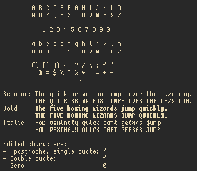

# Curie (fork by splintah)

A fork of a slightly upscaled version of scientifica.

This fork adds or modifies some characters to my liking, and adds an italic version (disclaimer: I'm not a font designer).

## Screenshots

These are screenshots of **this** fork.



## Installation

### Linux

Download Curie
```shell
cd ~
git clone https://github.com/splintah/curie
```
Symlink it to your fonts folder
```shell
ln -fs ~/curie/regular/curieMedium-12.bdf ~/.local/share/fonts/curieMedium-12.bdf
ln -fs ~/curie/bold/curieBold-12.bdf ~/.local/share/fonts/curieBold-12.bdf
ln -fs ~/curie/italic/curieItalic-12.bdf ~/.local/share/fonts/curieItalic-12.bdf
ln -fs ~/curie/bold-italic/curieBoldItalic-12.bdf ~/.local/share/fonts/curieBoldItalic-12.bdf
```

### macOS

Download Curie
```shell
cd ~
git clone https://github.com/splintah/curie
```

Open the .dfont files in the `regular`, `bold`, `bold-italic`, and `italic` folders.

Then, if you want to update the font with just `git pull`, symlink them to `~/Library/Fonts/`:
```shell
ln -fs ~/curie/regular/curieMedium.dfont ~/Library/fonts/curieMedium.dfont
ln -fs ~/curie/bold/curieBold.dfont ~/Library/fonts/curieBold.dfont
ln -fs ~/curie/italic/curieItalic.dfont ~/Library/fonts/curieItalic.dfont
ln -fs ~/curie/bold-italic/curieBoldItalic.dfont ~/Library/fonts/curieBoldItalic.dfont
```
